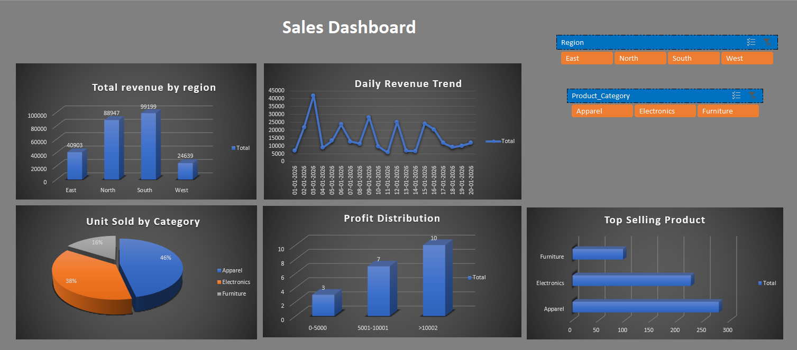

# 📊 Sales Dashboard (Excel Project)

## 🚀 Project Overview
This project is an interactive **Sales Dashboard** created using Microsoft Excel.  
It helps analyze sales performance using visualizations like charts, slicers, and KPIs.

The dashboard provides insights into:
- Revenue by region
- Daily sales trends
- Profit distribution
- Product category performance

---

## 📸 Dashboard Preview

---

## 📁 Dataset Details
The dataset contains the following columns:

- Date
- Region (East, North, South, West)
- Product Category (Apparel, Electronics, Furniture)
- Units Sold
- Unit Price
- Operational Cost
- Total Revenue
- Profit

---

## 📊 Features
✔ Interactive Dashboard  
✔ Region-wise filtering using slicers  
✔ Product category filtering  
✔ Daily revenue trend analysis  
✔ Profit distribution visualization  
✔ Top-selling product analysis  

---

## 📈 Key Insights
- South region generated the highest revenue  
- Apparel category has the highest sales  
- Revenue fluctuates significantly across dates  
- Higher profit observed in premium product sales  

---

## 🛠 Tools Used
- Microsoft Excel
- Pivot Tables
- Charts (Bar, Line, Pie)
- Slicers
- Data Cleaning & Formulas

---

## 📌 How to Use
1. Download the Excel file
2. Open in Microsoft Excel
3. Use slicers to filter data
4. Analyze charts and insights

---

## 🎯 Learning Outcome
- Dashboard design in Excel
- Data visualization
- Business insights generation
- KPI understanding

---

## 📎 Files Included
- `Sales_Dashboard.xlsx`
- `dashboard.png` (preview image)
- `README.md`

---

## 🙋‍♂️ Author
**Ashish Tiwari**

If you like this project, give it a ⭐ on GitHub!
